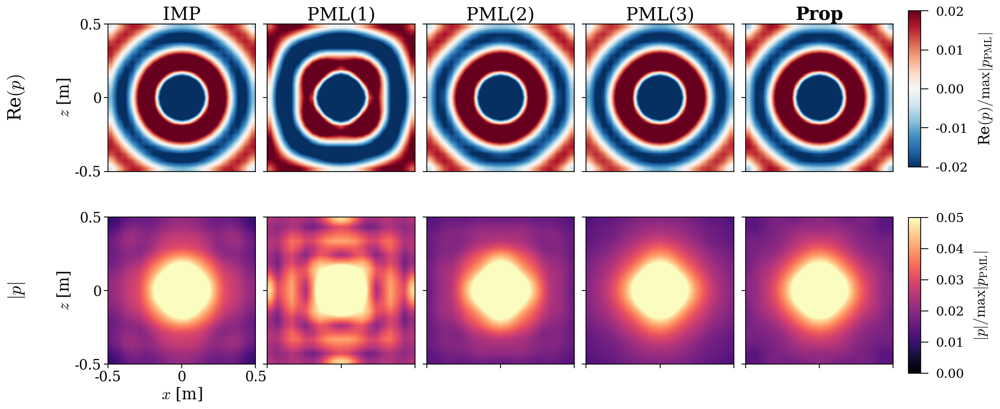

# Non-Reflecting Boundary Condition Based on the Wavenumber-Domain Reflection Coefficient (FEM)

**波数領域音響反射係数に基づく無反射境界条件：有限要素法における定式化**

Reference implementation and reproduction package for

> S. Hoshika, T. Iwami and A. Omoto,
> "Non-reflecting boundary condition based on wavenumber-domain acoustic reflection coefficient:
> Formulation in the finite element method,"
> *Proc. Autumn Meeting, Acoustical Society of Japan*, paper **2-Q-1**, 2026.
> (Kyushu University)

[English](#english) ｜ [日本語](#日本語)

---

## English

### What this is

A rectangular-box non-reflecting boundary condition (NRBC) for the 3-D Helmholtz equation,
obtained by imposing the **perfect-absorption form `C_r = 0`** of the wavenumber-domain
acoustic reflection coefficient directly as a finite-element boundary condition.

Unlike a scalar impedance condition, the admittance is assigned **per incidence direction**,
so oblique incidence is absorbed as well as normal incidence — and unlike a PML, no extra
mesh is added outside the computational domain.

The boundary operator is never formed explicitly. Each GMRES iteration applies

```
x  ->  F_Gamma  ->  diag(w * beta_0)  ->  F_Gamma^H  ->  M_Gamma
```

with the sparse interior matrix `A0 = K - k^2 M` and its LU factorization as the preconditioner.

### Results reproduced (f = 1000 Hz, 1 m cube, h = 0.05 m)

| Method    | r_corr    | eps_a     | W̄ [dB] | DOF    |
|-----------|-----------|-----------|---------|--------|
| IMP       | 0.964     | 0.209     | 0.46    | 9,261  |
| PML (1)   | 0.556     | 0.515     | 2.44    | 12,167 |
| PML (2)   | 0.967     | 0.196     | 0.50    | 15,625 |
| PML (3)   | 0.981     | 0.188     | 0.41    | 19,683 |
| **Prop**  | **0.984** | **0.193** | 0.41    | 9,261  |

The proposed method matches a 3-layer PML in accuracy while solving on the interior mesh only.



*Fig. 2 — Re(p) (top) and |p| (bottom) on the XZ slice. PML(1) shows a clear standing-wave pattern from residual reflection; the proposed method matches PML(3).*

### Quick start

```bash
pip install -r requirements.txt

python scripts/run_benchmark.py        # solve every case  -> results/state_1000Hz.pkl
python scripts/compute_table.py        # Table 2
python scripts/make_fig_fields.py      # Fig. 2  -> figures/fig2_fields.pdf
python scripts/make_fig_decay.py       # Figs. 3, 4
```

`results/state_1000Hz.pkl` is included, so the table and figure scripts run without
repeating the solves. The full benchmark takes roughly one minute on a modern laptop.

Supplementary checks:

```bash
python scripts/run_m_convergence.py    # accuracy vs. number of wavenumber samples M
python scripts/measure_memory_rss.py   # real process memory (maxRSS), LU factors included
```

### Layout

```
nrbc_cr0/
  config.py     analysis constants (changing them breaks reproduction)
  fem.py        hexahedral element matrices, assembly, PML stretching, mesh extension
  boundary.py   face topology, surface mass, Fibonacci disk sampling, C_r = 0 operator
  solvers.py    IMP / PML / Prop (GMRES) / Prop (direct) / infinite element
  metrics.py    r_corr, eps_a, W-bar
scripts/        runnable entry points (see Quick start)
mesh/           cube_lc005_hex.msh  (1 m cube, 20 x 20 x 20 hexahedra)
results/        precomputed state, generated tables
figures/        generated figures
```

### Notes on reproducibility

* **Memory column.** The memory values in the paper are `tracemalloc` peaks of the
  Python heap. They exclude the LU factors allocated inside SuperLU, which dominate
  for every method. This package reports the same quantity in `run_benchmark.py`;
  because the assembly was rewritten in sparse-triplet form, the peaks differ from the
  published numbers by a few MB (e.g. Prop 68 vs. 71 MB). `measure_memory_rss.py`
  measures true process `maxRSS` instead — there the proposed method sits close to IMP
  and far below any PML. Accuracy metrics are unaffected.
* **The common scale `s`.** The metric `eps_a` uses a single real scale shared by all
  methods, estimated as the median of the least-squares projections onto the analytical
  solution. The published values were obtained with the set
  `{IMP, IE4, Prop, PML4}`, so the infinite-element solver is kept in this package even
  though it is not compared in the paper. Dropping IE4 shifts `eps_a` by at most 0.0014.
* Field values agree with the original working scripts to a relative difference below
  `1e-10`.

### Related work

* S. Hoshika, T. Iwami, A. Omoto, *Proc. ASJ Autumn Meeting*, pp. 643–646 (2023) — the `C_r` operator.
* S. Hoshika, T. Iwami, A. Omoto, *Proc. INTER-NOISE 2024* (2024).
* S. Hoshika, T. Iwami, A. Omoto, *Proc. Mtgs. Acoust.* **60**, 015006 (2025).

### License

MIT. See [LICENSE](LICENSE).

---

## 日本語

### 概要

3 次元 Helmholtz 方程式に対する、直方体境界用の無反射境界条件（NRBC）の実装です。
波数領域音響反射係数の完全吸音形 `C_r = 0` を、有限要素法の境界条件として直接課します。

スカラインピーダンス条件が全方向に同一のアドミタンスしか与えられないのに対し、
本手法は**入射方向ごとに**適切なアドミタンスを与えるため、斜入射成分も吸収できます。
また PML と異なり、計算領域の外側に吸音層（追加メッシュ）を必要としません。

非局所境界作用素は陽に保持しません。GMRES の反復ごとに

```
x  ->  F_Gamma  ->  diag(w * beta_0)  ->  F_Gamma^H  ->  M_Gamma
```

の行列・ベクトル積として評価し、前処理には内部疎行列 `A0 = K - k^2 M` の LU 分解を用います。

### 再現される結果（f = 1000 Hz、1 m 立方体、h = 0.05 m）

| 手法       | r_corr    | eps_a     | W̄ [dB] | DOF    |
|------------|-----------|-----------|---------|--------|
| IMP        | 0.964     | 0.209     | 0.46    | 9,261  |
| PML（1層） | 0.556     | 0.515     | 2.44    | 12,167 |
| PML（2層） | 0.967     | 0.196     | 0.50    | 15,625 |
| PML（3層） | 0.981     | 0.188     | 0.41    | 19,683 |
| **提案法** | **0.984** | **0.193** | 0.41    | 9,261  |

提案手法は内部メッシュのみで、PML（3 層）と同等の精度を実現します。


*図 2 — XZ 断面の Re(p)（上段）と |p|（下段）。PML（1 層）では残留反射による定在波が顕著で、提案手法は PML（3 層）と同等の分布を示す。*

### 実行方法

```bash
pip install -r requirements.txt

python scripts/run_benchmark.py        # 全手法を計算 -> results/state_1000Hz.pkl
python scripts/compute_table.py        # 表 2
python scripts/make_fig_fields.py      # 図 2 -> figures/fig2_fields.pdf
python scripts/make_fig_decay.py       # 図 3・図 4
```

計算済みの `results/state_1000Hz.pkl` を同梱しているため、表・図のスクリプトは
再計算なしで実行できます。全手法の計算は近年の PC で 1 分程度です。

補足検証:

```bash
python scripts/run_m_convergence.py    # 波数サンプル数 M に対する収束性
python scripts/measure_memory_rss.py   # LU 因子を含む実メモリ（maxRSS）
```

### 構成

```
nrbc_cr0/
  config.py     解析条件の定数（変更すると論文の数値は再現しません）
  fem.py        六面体要素行列、全体組立、PML 複素伸長、外側メッシュ生成
  boundary.py   面トポロジ、面質量行列、Fibonacci 円板サンプリング、C_r = 0 作用素
  solvers.py    IMP / PML / 提案法（GMRES）/ 提案法（直接法）/ 無限要素
  metrics.py    r_corr、eps_a、W-bar
scripts/        実行スクリプト（上記「実行方法」参照）
mesh/           cube_lc005_hex.msh（1 m 立方体、20 x 20 x 20 六面体要素）
results/        計算済み state、生成した表
figures/        生成した図
```

### 再現性についての注記

* **メモリ列**: 論文のメモリ値は `tracemalloc` による Python ヒープのピークであり、
  SuperLU が C 側で確保する LU 因子（全手法で支配的）を含みません。本パッケージの
  `run_benchmark.py` も同じ量を出力しますが、全体組立を疎行列トリプレット方式へ
  整理したため、ピーク値は論文値と数 MB 異なります（例: 提案法 68 MB / 論文 71 MB）。
  実メモリで比較したい場合は `measure_memory_rss.py` を使ってください。
  そこでは提案法は IMP と同程度で、いずれの PML よりも大幅に小さくなります。
  精度指標はいずれの定義でも変わりません。
* **共通スケール `s`**: 指標 `eps_a` は全手法共通の実数スケール `s`（各手法解を
  解析解へ最小二乗射影した振幅の中央値）を用います。論文の数値は
  `{IMP, IE4, 提案法, PML4}` の集合で得られているため、論文本文では比較対象外の
  無限要素ソルバも再現用に同梱しています。IE4 を除いた場合の `eps_a` の変化は
  最大 0.0014 です。
* 音圧場は元の作業用スクリプトと相対差 `1e-10` 以下で一致することを確認済みです。

### 関連文献

* 星加、岩見、尾本、日本音響学会秋季研究発表会講演論文集、pp. 643–646 (2023) — `C_r` 作用素の提案
* S. Hoshika, T. Iwami, A. Omoto, *Proc. INTER-NOISE 2024* (2024)
* S. Hoshika, T. Iwami, A. Omoto, *Proc. Mtgs. Acoust.* **60**, 015006 (2025)

### ライセンス

MIT ライセンスです。[LICENSE](LICENSE) を参照してください。
